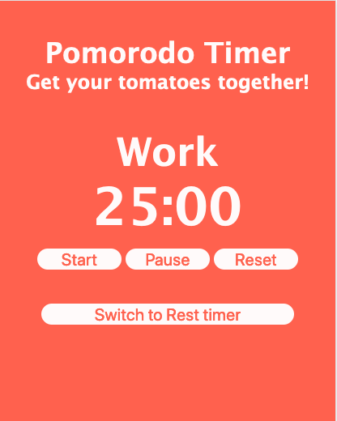

# APPLICATION #3: POMODORO TIMER
## A classic pomodoro timer: 
### 25 minutes of work & 5 minute rest periods. 

You can play with it live [here](https://skillitzimberg.github.io/pomodoro/).

## Summary

This the third app on my roadmap part of the Software Development Mastermind program. Building this app has really helped me get more comfortable manipulating and traversing the DOM.

The expectations for the project are described in [DELIVERABLES](./DELIVERABLES.md).  

The steps I took and other errata encountered while building are in [PLANNING](./PLANNING.md). I tried my best to have the commits track closely with this document.

## Author
Scott Bergler :: Full Stack Developer > [LinkedIn](https://www.linkedin.com/in/scott-bergler/) | [Personal Website](https://oceancode.dev/)